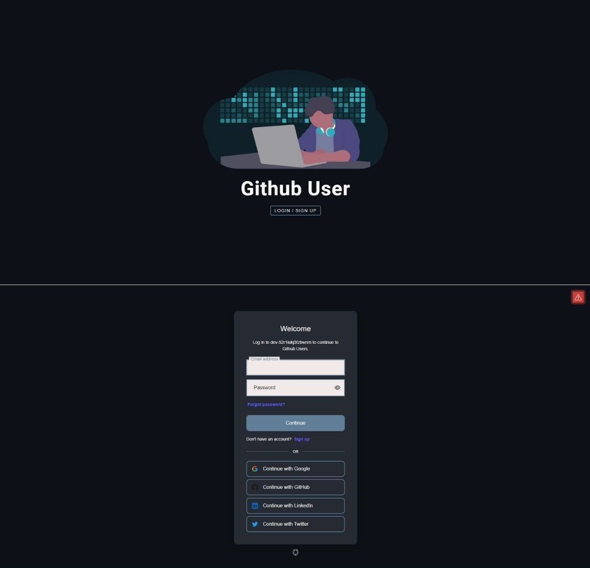
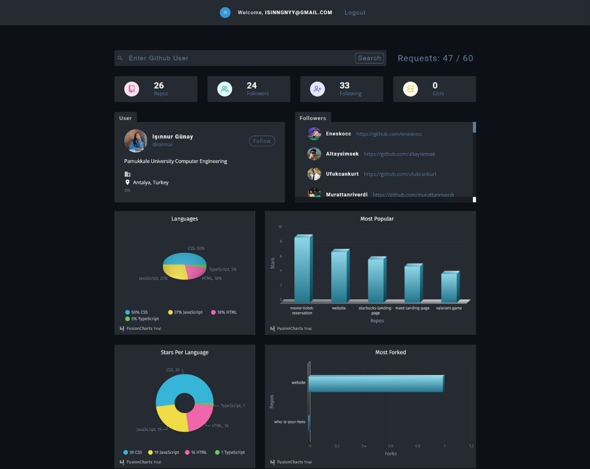

# Search Github Users

For unauthenticated requests, the rate limit allows for up to 60 requests per hour. Unauthenticated requests are associated with the originating IP address, and not the user making requests.
 You can view my project [here](https://r-search-github-users-r.netlify.app).

  
>  You can register and login.
  

>  You or the users you want to look at can see the most starred projects, most used languages and forked projects through charts.  

## Fusion Charts

- [Fusion Charts - Main Docs](https://www.fusioncharts.com/)
- [First React Chart](https://www.fusioncharts.com/dev/getting-started/react/your-first-chart-using-react)
- [List Of Charts](https://www.fusioncharts.com/dev/chart-guide/list-of-charts)
- [Themes](https://www.fusioncharts.com/dev/themes/introduction-to-themes)

## Auth0

- [Auth0 - Main Docs](https://auth0.com/)

